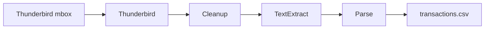

## CCParser

A tool to parse credit card statements from a Thunderbird profile into CSV files. One run processes every configured bank account: extract statement emails, clean PDFs, extract text, and parse transactions.

**Quick reference:** [TLDR.md](TLDR.md) — commands only, no long docs.

**Requirements:** Python 3.12+

### Project layout

```
CCParser/
├── pyproject.toml                 # dependencies and ccparser entry point
├── extractor.config.sample.json   # copy to extractor.config.json for local dev
├── src/
│   ├── cli.py               # shared argparse helpers
│   ├── settings.py          # Pydantic config loading
│   ├── core/                # paths, amounts, dates, PDF I/O, account iteration
│   ├── pipeline/            # thunderbird, cleanup, text_extract, parse
│   └── parsers/             # bank-specific statement parsers (bob, pnb, idfc)
└── tests/
```

### Pipeline



| Stage        | Command                     | Input → Output                           |
| ------------ | --------------------------- | ---------------------------------------- |
| Extract      | `src.pipeline.thunderbird`  | mbox attachments → raw PDFs in `{bank}/` |
| Cleanup      | `src.pipeline.cleanup`      | loose PDFs → decrypted `FY*/YYYY-MM.pdf` |
| Text extract | `src.pipeline.text_extract` | PDFs → sanitized `txt/FY*/YYYY-MM.txt`   |
| Parse        | `src.pipeline.parse`        | `.txt` files → `transactions.csv`        |

The parse stage reads **text files only** (not PDFs). Run `text_extract` before `parse`.

### Configuration

The sample config at [`extractor.config.sample.json`](extractor.config.sample.json) shows the expected format. For local development, copy it to `extractor.config.json` at the repo root.

Production config (secrets, real paths):

```
/invar/secret-manager/c05/financial-footprints/extractor.config.json
```

**Config resolution order** (first match wins):

1. `-c` / `--config` on the command line
2. `CCPARSER_CONFIG` environment variable
3. `extractor.config.json` at the repo root (default)

Examples:

```bash
# Use production config for one run
python -m src -c /invar/secret-manager/c05/financial-footprints/extractor.config.json

# Or set it for the shell session
export CCPARSER_CONFIG=/invar/secret-manager/c05/financial-footprints/extractor.config.json
python -m src
python -m src.pipeline.parse
```

All entry points support `-c` / `--config`: `src`, `src.pipeline.thunderbird`, `src.pipeline.cleanup`, `src.pipeline.text_extract`, and `src.pipeline.parse`.

Paths in the config (`profile`, `download_path`, `mbox`) may be absolute or relative to the **config file's directory** (not the repo root).

Example config:

```json
{
  "profile": "/path/to/thunderbird/profile",
  "download_path": "/path/to/statements",
  "start_date": "2024-06-01",
  "create_combined_csv": true,
  "accounts": [
    {
      "bank": "icici",
      "subjects": [
        "Amazon Pay ICICI Bank Credit Card Statement for the period",
        "ICICI Bank Credit Card Statement for the period"
      ],
      "passwords": ["your-icici-password"]
    },
    {
      "bank": "hdfc/swiggy",
      "subjects": ["HDFC Bank - Swiggy HDFC Bank Credit Card Statement"],
      "passwords": ["your-hdfc-swiggy-password"]
    }
  ]
}
```

| Field                 | Required | Description                                                                                                                               |
| --------------------- | -------- | ----------------------------------------------------------------------------------------------------------------------------------------- |
| `profile`             | Yes      | Thunderbird profile directory                                                                                                             |
| `download_path`       | Yes      | Base folder for statement files; each account uses `{download_path}/{bank}/` (supports nested paths like `hdfc/swiggy`)                   |
| `start_date`          | No       | ISO date (`YYYY-MM-DD`) or `null`. When set, only emails on or after this date are extracted. Emails without a `Date` header are skipped. |
| `accounts`            | Yes      | Non-empty list of account entries (see below)                                                                                             |
| `create_combined_csv` | No       | When `true`, writes `combined_transactions.csv` per account folder                                                                        |
| `mbox`                | No       | Limit extraction to a single mbox file instead of scanning the profile                                                                    |

Each account entry requires:

| Field       | Required | Description                                                                                                                               |
| ----------- | -------- | ----------------------------------------------------------------------------------------------------------------------------------------- |
| `bank`      | Yes      | Folder name under `download_path` (e.g. `pnb`, `hdfc/swiggy`). Parser key is the first path segment (`hdfc/swiggy` → `hdfc`)              |
| `subjects`  | Yes      | Non-empty array of subject substrings; extraction matches if **any** subject matches (case-insensitive). A single string is also accepted |
| `passwords` | Yes      | Non-empty array of PDF passwords to try, in order (duplicates removed)                                                                    |

Legacy `subject` (singular string) is still accepted and treated as a one-element `subjects` array.

**Breaking change:** legacy single-password fields (`password`, `pdf_password`) are no longer supported. Use a `passwords` array for every account.

Statement PDFs are password-protected. Each bank account has its own password list; cleanup and text extraction try each password until one works.

After cleanup, statement PDFs live under `{download_path}/{bank}/FY*/`. Text extraction writes sanitized plain-text copies to `{download_path}/{bank}/txt/FY*/`, one `.txt` per PDF (same filename stem). Parsing reads those `.txt` files.

## Usage

Install from the repo root:

```bash
pip install -e .
```

Full pipeline for all accounts (extract → cleanup → text extract → parse):

```bash
ccparser
python -m src
python -m src -c /path/to/extractor.config.json
```

Extract only (all accounts):

```bash
python -m src.pipeline.thunderbird
```

Cleanup only (all account subfolders under `download_path`):

```bash
python -m src.pipeline.cleanup
```

Or cleanup a single account directory (must match a configured `{download_path}/{bank}/` path):

```bash
python -m src.pipeline.cleanup /path/to/statements/idfc
python -m src.pipeline.cleanup -c /path/to/extractor.config.json /path/to/statements/idfc
```

Text extract only (all accounts):

```bash
python -m src.pipeline.text_extract
```

Or text extract a single account directory:

```bash
python -m src.pipeline.text_extract /path/to/statements/idfc
```

Parse only (all accounts):

```bash
python -m src.pipeline.parse
```

Or parse a single account directory:

```bash
python -m src.pipeline.parse --account /path/to/statements/idfc
```

Optional: limit parsing to a single FY folder within each account directory:

```bash
python -m src.pipeline.parse --fy FY23-2024
python -m src.pipeline.parse --account /path/to/statements/idfc --fy FY23-2024
```

Cleanup steps: non-PDF removal, decrypt, dedupe, rename to `YYYY-MM.pdf`, then organize into India FY folders such as `FY23-2024/` for Apr 2023–Mar 2024.

Text extraction uses pdfplumber with layout-preserving extraction, then sanitizes output to an English bank-statement character set (letters, digits, whitespace, common punctuation, and table line characters). Skips PDFs whose txt file is already up to date.

CSV columns: `Date`, `Description`, `Ref`, `Credited`, `Debited`, `File`. `Ref` is populated for BoB rows that include a reference number (e.g. `R00935`); otherwise empty.

Close Thunderbird before running against a live profile path.

### Tests

```bash
python -m unittest discover -s tests
```
