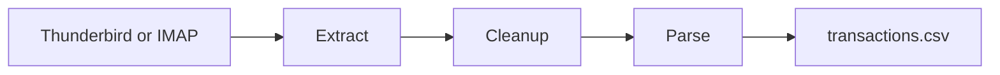
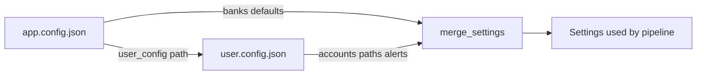

## CCParser

A tool to parse credit card statements from email into CSV files. One run processes every configured bank account: extract statement emails (Thunderbird local cache or live IMAP), prepare paired PDF/TXT files, and parse transactions.

**Quick reference:** [TLDR.md](TLDR.md) — commands only, no long docs.

**Requirements:** Python 3.11+

### Project layout

```
CCParser/
├── pyproject.toml                 # dependencies and ccparser entry point
├── app.config.json                # bank defaults (checked in)
├── user.config.json               # sample user config (edit paths/passwords)
├── src/
│   ├── cli.py               # shared entry-point helpers
│   ├── settings.py          # Pydantic config loading
│   ├── utils/               # paths, PDF I/O, email, alerts, account iteration
│   └── pipeline/            # get_statements, cleanup, parse stages
│       ├── get_statements/  # extract, imap, thunderbird
│       ├── cleanup/         # cleanup, statement_text, text_extract alias
│       └── parse/           # parse, statement parser
└── tests/
```

### Pipeline



| Stage   | Command                          | Input → Output                                                                 |
| ------- | -------------------------------- | ------------------------------------------------------------------------------ |
| Extract | `src.pipeline.get_statements`    | email attachments → raw PDFs in `{bank}/` or `{bank}/{variant}/`               |
| Cleanup | `src.pipeline.cleanup`           | raw PDFs → paired `FY*/YYYY-MM.pdf` + `FY*/YYYY-MM.txt` (sibling files, one extract) |
| Parse   | `src.pipeline.parse`             | paired `.txt` files → `FY*/transactions.csv`                                   |

`src.pipeline.get_statements.thunderbird` and `src.pipeline.get_statements.imap` still work for a single source type only.

Cleanup decrypts each PDF, extracts text once, validates the account `identifier` against sanitized text, and writes matching PDF/TXT siblings in FY folders. The parse stage reads **text files only** (not PDFs). Run `cleanup` before `parse`.

`python -m src.pipeline.cleanup.text_extract` still works as an alias for cleanup.

### Configuration

CCParser uses two JSON files. The **app config** holds bank-specific defaults (email matching rules, text-extraction markers). The **user config** holds secrets and machine-local paths (email source, download folder, PDF passwords, optional alerts). At startup the app loads the app config, resolves the user config path from it, loads both, merges per-account defaults, and exits with an error if anything is invalid.



Reference templates: [`app.config.json`](app.config.json), [`user.config.sample.json`](user.config.sample.json).

#### App config resolution

The app config path is chosen in this order (first match wins):

1. `CCPARSER_CONFIG` environment variable
2. `app.config.json` at the repo root (default)

All entry points read config at startup: `src`, `src.pipeline.get_statements`, `src.pipeline.cleanup`, `src.pipeline.cleanup.text_extract`, and `src.pipeline.parse`. There are no CLI flags; account scope, FY limits, and other options are set in the user config `run` block.

```bash
export CCPARSER_CONFIG=/invar/secret-manager/c05/financial-footprints/app.config.json
python -m src
python -m src.pipeline.parse
```

#### Path resolution

| Path                                                         | Resolved relative to         |
| ------------------------------------------------------------ | ---------------------------- |
| `user_config` in app config                                  | App config file's directory  |
| `source.thunderbird.profile`, `download_path` in user config | User config file's directory |

Paths may be absolute or relative. Use absolute paths in production when the user config lives outside the repo.

**Production layout:**

```
export CCPARSER_CONFIG=/invar/secret-manager/c05/financial-footprints/app.config.json
app.config.json   → user_config: /invar/secret-manager/c05/financial-footprints/user.config.json
user.config.json  (secrets, real paths — outside repo or on secret-manager)
```

For local development, copy [`user.config.sample.json`](user.config.sample.json) to `user.config.json` and edit paths and passwords.

#### Validation rules

- Unknown keys in either config file are rejected (`extra="forbid"`).
- `bank` and `variant` ids are normalized to lowercase; they must not contain `/` or `\`.
- Each `(bank, variant)` pair may appear at most once in `accounts`.
- Config errors surface at startup as `error: invalid user config ...` or `error: invalid app config ...` and stop the run before any pipeline stage executes.
- Every `bank` in the user config must exist in app config `banks`.
- Every bank in app config `banks` must define a `default` variant with `subjects`.

#### App config (`app.config.json`)

| Field         | Required | Description                                                                      |
| ------------- | -------- | -------------------------------------------------------------------------------- |
| `user_config` | Yes      | Path to the user/secrets config file                                             |
| `banks`       | Yes      | Object keyed by bank id; each value is an object keyed by variant id (see below) |

Each bank must define a `default` variant plus optional named overrides. Matching settings merge in three layers:

1. **`default`** — liberal catch-all base (required on every bank).
2. **Named variant** in app config (e.g. `amazon`, `easy`) — only fields present in that entry override `default`.
3. **User account** — any field set on the account entry wins last.

```json
"banks": {
  "bob": {
    "default": { "subjects": ["E-statement for your BOB"] },
    "easy": { "subjects": ["E-statement for your BOB EASY credit card ending in"] }
  }
}
```

| Field                 | Required on `default` | Required on named variants | Description                                                                                                                                                                              |
| --------------------- | --------------------- | -------------------------- | ---------------------------------------------------------------------------------------------------------------------------------------------------------------------------------------- |
| `subjects`            | Yes                   | No                         | Non-empty array of subject substrings. Thunderbird extraction matches if **any** subject appears in the email subject (case-insensitive). A single string is also accepted.              |
| `bodies`              | No                    | No                         | Body substrings; extraction matches if **any** substring appears in the email body (case-insensitive). Omit or `[]` to skip. Used when subject alone is ambiguous (e.g. Federal Signet). |
| `from`                | No                    | No                         | Sender filters. Each entry is a full email (`user@bank.com`) or domain (`bank.com`). **Any** match (OR). Entries are lowercased. Omit or `[]` to skip.                                   |
| `start_marker`        | No                    | No                         | Substring marking where statement text begins; lines before the first match are dropped. The matching line is kept. Defaults to the start of the file.                                   |
| `end_marker`          | No                    | No                         | Substring marking where statement text ends; lines after the first match are dropped. The matching line is kept.                                                                         |
| `information_markers` | No                    | No                         | Array of substrings; matching text is removed from sanitized output. Long markers also match as a line block from the first 6 words through the last 4 words.                            |

Named variants must set at least one field (typically `subjects`). Identical duplicate variants are omitted from app config; use any `variant` id in user config and inherit from `default`.

**Supported banks** (defined in [`app.config.json`](app.config.json)):

| Bank       | Named overrides                                                    | Notes                                                            |
| ---------- | ------------------------------------------------------------------ | ---------------------------------------------------------------- |
| `bob`      | `easy`                                                             | BOB EASY                                                         |
| `csb`      | `edge`                                                             | Edge CSB Bank (Jupiter)                                          |
| `federal`  | `edge`, `signet`                                                   | Signet uses `bodies` filter                                      |
| `hdfc`     | `diners`, `regalia`, `regalia-gold`, `swiggy`, `tata-neu-infinity` | Each card has a specific subject override                        |
| `icici`    | `amazon`                                                           | Generic ICICI cards use `default` only                           |
| `idfc`     | `wow`                                                              | IDFC FIRST WOW!                                                  |
| `indusind` | —                                                                  | Generic IndusInd cards use `default` only                        |
| `pnb`      | `platinum`                                                         | PNB Platinum; `end_marker` and `information_markers` on override |
| `yes`      | `ace`                                                              | YES ACE Rupay                                                    |

#### User config (`user.config.json`)

| Field           | Required | Description                                                                                                                                |
| --------------- | -------- | ------------------------------------------------------------------------------------------------------------------------------------------ |
| `source`        | Yes*     | Email source: `type` is `thunderbird` or `email` (see [Email sources](#email-sources)). *Legacy top-level `profile` is still accepted.     |
| `download_path` | Yes      | Base folder for statement files. Each account uses `{download_path}/{bank}/` or `{download_path}/{bank}/{variant}/` when a variant is set. |
| `start_date`    | No       | ISO date (`YYYY-MM-DD`) or `null`. When set, only emails on or after this date are extracted. Emails without a `Date` header are skipped.  |
| `accounts`      | Yes      | Non-empty list of enabled bank accounts (see below)                                                                                        |
| `alerts`        | No       | Optional alert delivery settings (see [Alerts](#alerts)). Omit entirely to disable alert delivery.                                         |
| `run`           | No       | Optional run scope and stage options (see below). Defaults to all accounts, all FYs.                                                       |

#### Email sources

CCParser can extract statement PDFs from email in two ways. Set `source.type` in `user.config.json`.

**Thunderbird (`source.type: thunderbird`)** — reads locally cached mail from a Thunderbird profile. Mail must already be synced to disk (e.g. Gmail account added in Thunderbird). CCParser auto-discovers **all** mbox stores under `{profile}/ImapMail/**` and `{profile}/Mail/Local Folders/**` (files with a sibling `.msf` index). **Close Thunderbird** before running (file locking). No inbox/folder setting — every synced folder is scanned.

**mbox** is an internal file format Thunderbird uses on disk; it is not a config option. Google Takeout `.mbox` exports are not supported as a direct source.

**IMAP (`source.type: email`)** — connects read-only to any IMAP provider (Gmail, Outlook, etc.), searches by subject/date, and saves matching attachments. Uses only `EXAMINE`, `SEARCH`, and `BODY.PEEK` — never marks mail read, deletes, or uploads. Attachments are saved to local disk only.

| Provider | `host` | Typical `folder` |
| -------- | ------ | ---------------- |
| Gmail | `imap.gmail.com` | `[Gmail]/All Mail` |
| Outlook / M365 | `outlook.office365.com` | `INBOX` |

Gmail IMAP setup: enable IMAP in Gmail settings, enable 2FA, create an [App Password](https://myaccount.google.com/apppasswords).

**Thunderbird example:**

```json
"source": {
  "type": "thunderbird",
  "thunderbird": {
    "profile": "/path/to/thunderbird/profile"
  }
}
```

**Gmail IMAP example:**

```json
"source": {
  "type": "email",
  "email": {
    "host": "imap.gmail.com",
    "username": "you@gmail.com",
    "password": "your-app-password",
    "folder": "[Gmail]/All Mail"
  }
}
```

`folder` is IMAP-only. Default `INBOX` if omitted; Gmail users should use `[Gmail]/All Mail` to include archived mail. v1 IMAP scans one folder per config.

Legacy configs with top-level `profile` (no `source` block) still work. The `mbox` config key is **removed** — configs containing `mbox` fail with an error.

Optional `run` block (controls which accounts run and stage-specific options):

| Field                     | Default                               | Description                                                      |
| ------------------------- | ------------------------------------- | ---------------------------------------------------------------- |
| `run.bank`                | omitted → all accounts                | Limit stages to accounts with this bank id                       |
| `run.variant`             | omitted → all variants for `run.bank` | Further limit to one variant (requires `run.bank`)               |
| `run.fy`                  | `null` → all FY folders               | Parse only this FY folder name (e.g. `FY23-2024`)                |
| `run.force_text_extract`  | `false`                               | Re-prepare all statement pairs even when TXT is up to date       |
| `run.create_combined_csv` | `false`                               | Write `combined_transactions.csv` across FY folders when parsing |

Each entry in `accounts`:

| Field        | Required | Description                                                                                                                                                                                                                                           |
| ------------ | -------- | ----------------------------------------------------------------------------------------------------------------------------------------------------------------------------------------------------------------------------------------------------- |
| `bank`       | Yes      | Bank id matching a key in app config `banks` (e.g. `pnb`, `icici`, `hdfc`)                                                                                                                                                                            |
| `identifier` | Yes      | Substring that must appear in each statement's sanitized text (e.g. last 4 digits or masked card number). Used during cleanup to pick the correct PDF when multiple downloads share the same month; if none match, no PDF or TXT is kept for that month.                                                                                   |
| `passwords`  | Yes      | Non-empty array of PDF passwords to try, in order. Duplicates are removed.                                                                                                                                                                            |
| `variant`    | No       | Card product id for folder layout (`{bank}/{variant}/`). When set, app-config `default` merges with that named override if present. When omitted, `default` alone applies. Any id works (e.g. `coral`); unknown ids inherit `default` matching rules. |

Optional per-account overrides (applied after app-config merge):

| Field                 | Description                             |
| --------------------- | --------------------------------------- |
| `subjects`            | Override email subject substrings       |
| `bodies`              | Override email body substrings          |
| `from`                | Override sender email or domain filters |
| `start_marker`        | Override text-extraction start marker   |
| `end_marker`          | Override text-extraction end marker     |
| `information_markers` | Override information markers            |

**How merging works:** For each account, CCParser starts from `banks[bank].default`, overlays `banks[bank][variant]` when that key exists in app config, then applies any fields set on the user account entry. Omitted user `variant` uses `default` only. A user `variant` not in app config (e.g. `coral`) still sets the download folder name but inherits `default` matching rules unless you override fields on the account.

[`user.config.sample.json`](user.config.sample.json) lists one account per bank. Add more entries for additional cards from the same bank.

**Secrets:** `user.config.json` holds PDF passwords and, when email alerts are used, the SMTP password. Do not commit it with real values.

Statement PDFs are password-protected. Each bank account has its own password list; cleanup tries each password until one works.

After cleanup, each statement month has a paired PDF and TXT as sibling files in an FY folder:

```
{download_path}/{bank}/FY23-2024/2024-01.pdf
{download_path}/{bank}/FY23-2024/2024-01.txt
```

When a variant is set, paths use `{download_path}/{bank}/{variant}/FY*/…`.

When multiple raw downloads map to the same month, cleanup extracts text once per candidate, keeps the first whose **sanitized text** contains the account `identifier`, and deletes the rest. If none match, no PDF or TXT for that month is kept and an alert is emitted. Parsing reads only the `.txt` files in `FY*/`.

#### Alerts

Alerts notify you of pipeline validation failures (for example, a statement whose sanitized text does not contain the account `identifier`). They are optional and configured entirely in the user config.

**Choosing a delivery method:** Set `alerts.type` to exactly one of `"console"` or `"email"`. You cannot enable both at once.

| `alerts.type` | When alerts are sent | How                                                                         |
| ------------- | -------------------- | --------------------------------------------------------------------------- |
| omitted       | Never                | No structured alert delivery (warnings still logged during cleanup) |
| `"console"`   | As each alert occurs | Logged to stderr with `ALERT [...]` prefix                                  |
| `"email"`     | End of run           | One batched SMTP message listing all alerts                                 |

**Config fields:**

| Field                       | Required                       | Description                                                 |
| --------------------------- | ------------------------------ | ----------------------------------------------------------- |
| `alerts.type`               | Yes (when `alerts` is present) | `"console"` or `"email"`                                    |
| `alerts.email`              | Yes when `type` is `"email"`   | Nested SMTP settings block                                  |
| `alerts.email.smtp_host`    | Yes when `type` is `"email"`   | SMTP server hostname (e.g. `smtp.gmail.com`)                |
| `alerts.email.smtp_port`    | Yes when `type` is `"email"`   | SMTP server port (e.g. `587`)                               |
| `alerts.email.use_tls`      | No                             | Use STARTTLS (default: `true`)                              |
| `alerts.email.username`     | Yes when `type` is `"email"`   | SMTP login username                                         |
| `alerts.email.password`     | Yes when `type` is `"email"`   | SMTP password (stored in user config)                       |
| `alerts.email.from_address` | Yes when `type` is `"email"`   | Sender email address                                        |
| `alerts.email.to`           | Yes when `type` is `"email"`   | Non-empty array of recipient addresses (or a single string) |

**Validation:**

- When `type` is `"email"`, the `email` block is required and every field above must be present and non-empty.
- When `type` is `"console"`, the `email` block must not be present.
- Invalid alert config fails at startup (same as any other config error).

**Console example** (also the default in [`user.config.sample.json`](user.config.sample.json)):

```json
"alerts": {
  "type": "console"
}
```

**Email example:**

```json
"alerts": {
  "type": "email",
  "email": {
    "smtp_host": "smtp.gmail.com",
    "smtp_port": 587,
    "use_tls": true,
    "username": "your.name@gmail.com",
    "password": "your-smtp-password",
    "from_address": "your.name@gmail.com",
    "to": ["your.name@gmail.com"]
  }
}
```

Replace host, port, and addresses for your provider.

**Note:** Identifier mismatches during text extraction are always logged as warnings regardless of alert settings. The alert handlers are for structured alert delivery when the pipeline emits validation failures.

#### Example user config

```json
{
  "source": {
    "type": "thunderbird",
    "thunderbird": {
      "profile": "/path/to/thunderbird/profile"
    }
  },
  "download_path": "/path/to/statements",
  "start_date": "2024-06-01",
  "alerts": {
    "type": "console"
  },
  "accounts": [
    {
      "bank": "icici",
      "variant": "amazon",
      "identifier": "1234",
      "passwords": ["your-icici-amazon-password"]
    },
    {
      "bank": "icici",
      "variant": "coral",
      "identifier": "5678",
      "bodies": ["XX1001"],
      "passwords": ["your-icici-coral-password"]
    },
    {
      "bank": "hdfc",
      "variant": "swiggy",
      "identifier": "9012",
      "passwords": ["your-hdfc-swiggy-password"]
    },
    {
      "bank": "pnb",
      "variant": "platinum",
      "identifier": "3456",
      "passwords": ["your-pnb-password"]
    }
  ]
}
```

The `coral` account uses `default` subjects (no `coral` key in app config) plus the account-level `bodies` override. Statements land under `{download_path}/icici/coral/`.

**Breaking changes:** Legacy single-password fields (`password`, `pdf_password`) and `card_id` are no longer supported. Slash-path bank keys (e.g. `hdfc/swiggy`) are replaced by `bank` + `variant`. Legacy alert keys (`alerts.console`, `alerts.email.enabled`, `password_env`) are replaced by `alerts.type` and nested `alerts.email`. Top-level `profile` is deprecated in favor of `source.type: thunderbird`; the `mbox` config key is removed.

## Usage

Install from the repo root:

```bash
pip install -e .
```

Full pipeline for all accounts (extract → cleanup → parse):

```bash
ccparser
python -m src
export CCPARSER_CONFIG=/path/to/app.config.json
python -m src
```

All entry points use `CCPARSER_CONFIG` when set, otherwise repo-root `app.config.json`. Account scope, FY limits, and other options are set in the user config `run` block.

Extract only:

```bash
python -m src.pipeline.get_statements
python -m src.pipeline.get_statements.thunderbird   # thunderbird source only
```

Close Thunderbird before running against a live profile path (Thunderbird source only).

Cleanup and parse (all configured accounts by default):

```bash
python -m src.pipeline.cleanup
python -m src.pipeline.parse
```

To limit a run to one account or FY, set the `run` block in `user.config.json`:

```json
"run": {
  "bank": "idfc",
  "variant": "wow",
  "fy": "FY23-2024",
  "force_text_extract": false,
  "create_combined_csv": false
}
```

Omit `run` entirely (or leave `bank` / `variant` null) to process every account in `accounts`.

Cleanup steps: non-PDF removal, decrypt, single-pass extract with identifier validation on sanitized text, write paired `FY*/YYYY-MM.pdf` and `FY*/YYYY-MM.txt` as sibling files, orphan sweep, and removal of legacy `PDF/` and `TXT/` folders. India FY folders such as `FY23-2024/` cover Apr 2023–Mar 2024.

Cleanup uses pdfplumber with layout-preserving extraction, then optionally trims content by per-account `start_marker` / `end_marker` substrings, drops lines matching `information_markers`, and sanitizes output to an English bank-statement character set (letters, digits, whitespace, common punctuation, and table line characters). Tabs are converted to spaces without collapsing other whitespace. Skips months whose paired TXT is already up to date unless `force_text_extract` is set.

CSV columns: `Date`, `Description`, `Ref`, `Credited`, `Debited`, `File`. Parsing is implemented in `src/pipeline/parse/statement.py` and reads sanitized `.txt` files from `FY*/`.

Close Thunderbird before running against a live profile path (Thunderbird source only).

### Tests

```bash
python -m unittest discover -s tests
```
